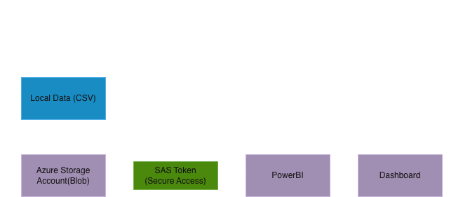
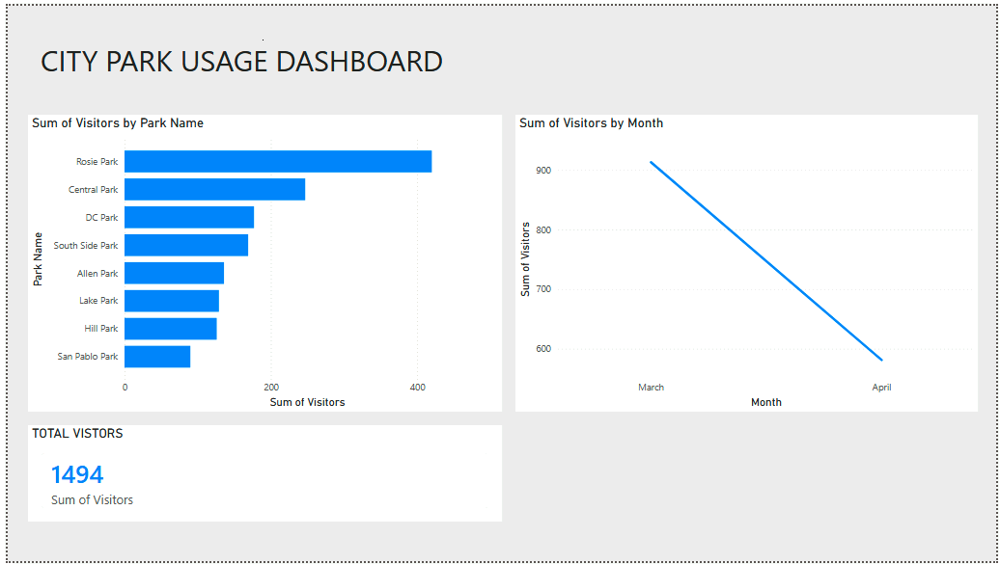

# Azure Cloud Integration: Secure Data Flow to Power BI
This project focuses on the practical side of cloud infrastructure: getting data into the cloud and ensuring it stays secure while in transit. I built this to demonstrate a clean workflow between Azure Blob Storage and Power BI, specifically focusing on how to manage access without compromising security.

### The Objective
The goal was to move beyond local file management and implement a cloud-native data source. The project highlights the end-to-end process of provisioning storage, configuring identity and access, and establishing a secure connection to a visualization tool.

### Cloud Architecture & Implementation
Azure Blob Storage Configuration
I used the Azure Portal to provision a storage account and set up a blob container to host the city dataset. This part of the project involved:

- Organizing the container hierarchy for easy data retrieval.

- Understanding the difference between public and private access levels at the container level.

### Securing the Pipeline with SAS
The "star" of this implementation is the security layer. Rather than using the primary Account Key (which provides full control), I implemented Shared Access Signatures (SAS).

- The Logic: I generated a SAS URI to provide Power BI with "Read-Only" access.

- The Benefit: This follows the principle of least privilege. It creates a secure, time-bound bridge that allows the dashboard to refresh without exposing the entire storage account backend.

### Power BI Connectivity
To wrap up the project, I configured the Power BI data connector to target the Azure Blob service. By using the SAS token as the authentication method, I successfully pulled the cloud data into the report layer. This proves that the data can be managed centrally in the cloud while being accessed securely by external tools.

### Key Technical Skills Demonstrated
- Azure Portal Navigation: Creating and configuring storage resources.

- Identity & Access Management (IAM): Using SAS tokens over account keys for better security.

- Data Integration: Connecting Power BI to cloud-hosted datasets via secure URIs.

### Architecture Diagram

### City Data Power Bi Dashboard
